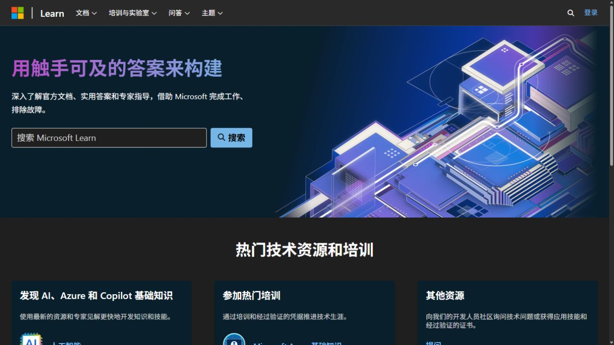
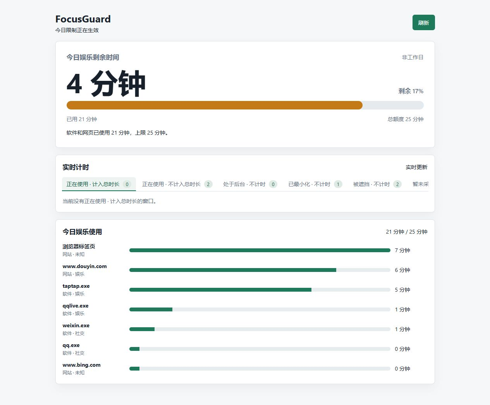
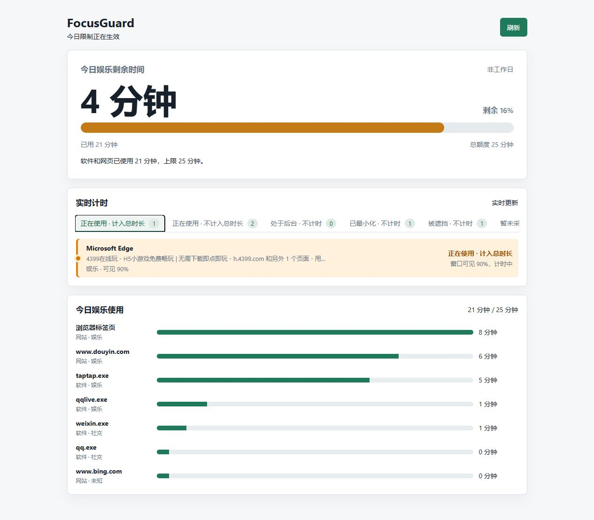
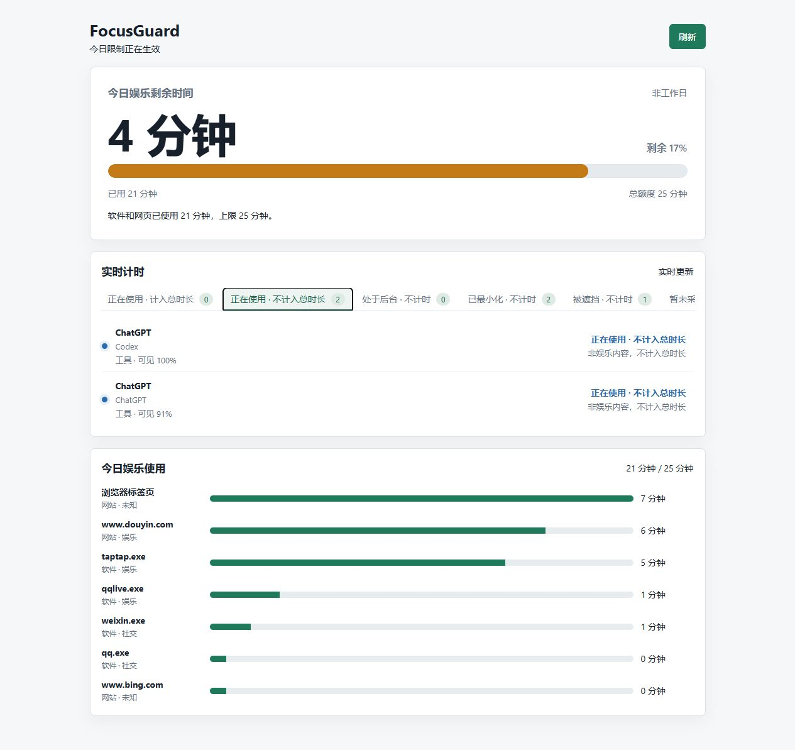
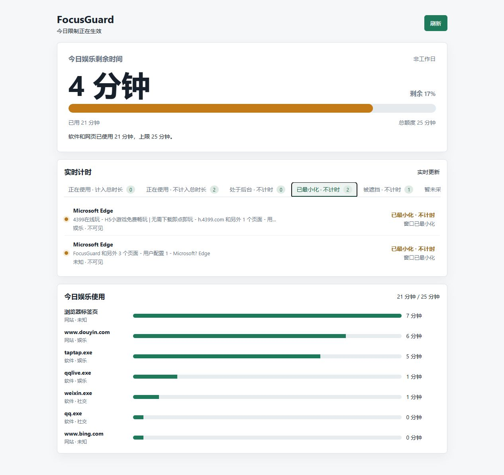
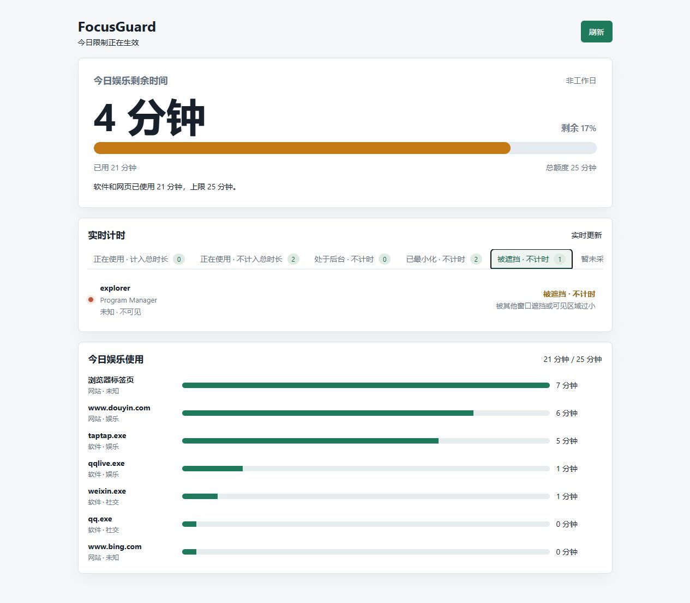
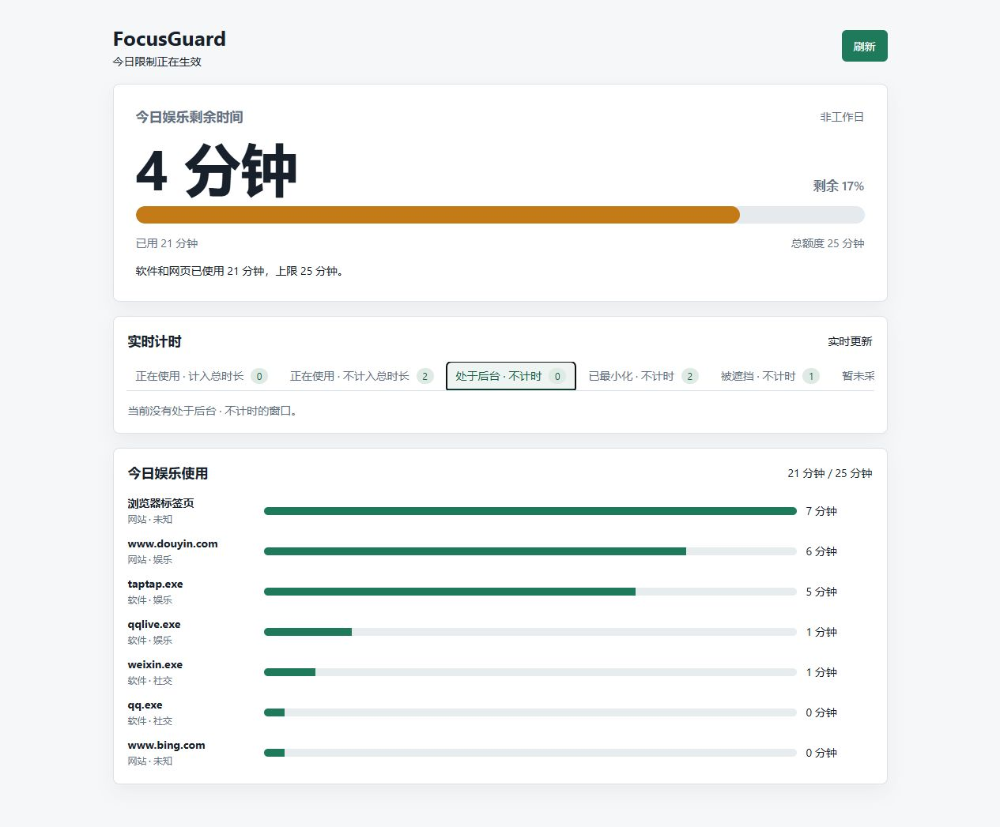
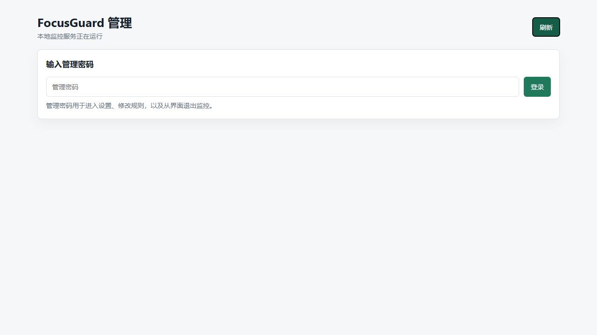

# FocusGuard

FocusGuard 是一款面向 Windows 的本地家长控制与专注管理工具。它通过原生窗口采样和浏览器扩展识别应用、浏览器窗口及网页标签页的使用情况，再使用 DeepSeek 对软件和网页用途进行分类。

FocusGuard 提供儿童查看页和密码保护的管理页，支持工作日/非工作日分别设置娱乐总额度。娱乐软件、娱乐网页和社交内容共用同一额度，达到上限后可以自动关闭受限软件或浏览器标签页。

> 本项目适用于你拥有或负责管理的 Windows 设备。它不是不可绕过的系统安全边界：拥有 Windows 管理员权限的人可以停止服务、修改计划任务、删除策略或卸载程序。

## 功能概览

- 本地网页界面，不创建托盘图标
- 儿童查看页：剩余时间、今日娱乐使用、实时窗口状态
- 管理页：密码登录、额度、AI、白名单和浏览器规则配置
- 按应用可执行文件、窗口标题和浏览器网页内容进行分类
- 娱乐和社交内容共用每日总额度
- 工作日和非工作日使用不同额度
- Edge/Chrome 浏览器扩展上报每个浏览器窗口的活动标签页
- Windows 原生窗口采样识别最小化、遮挡、并排可见和多窗口
- 常见其他浏览器进程阻止
- 可选的 Edge/Chrome 企业策略强制安装扩展
- 支持管理员权限开机启动

## 截图与真实使用链路

下面的截图来自一次实际运行链路，不是用设计图拼出的静态示例。演示时打开了娱乐网页和学习网页作为对比输入，并把一个实际运行的 Edge 娱乐窗口切到前台，让 FocusGuard 根据原生窗口可见面积和网页分类实时更新儿童端。

### 1. 准备不同用途的页面

演示输入使用了一个娱乐页面和一个学习页面。实际部署时可以换成任意网站；网页是否计入额度由本地规则、标题白名单和 DeepSeek 分类共同决定。




### 2. 儿童端看到前台娱乐窗口

儿童端首页先展示当天的额度进度和娱乐明细，软件与网页会出现在同一份使用列表中。



当 Edge 娱乐窗口处于前台且有约 90% 的窗口区域可见时，它会进入“正在使用 · 计入总时长”，整行使用橙色背景突出。下面的 4 分钟、25 分钟和窗口标题都是运行时快照，换一天运行不会固定显示这些数值。



### 3. 工具窗口可见，但不消耗娱乐额度

工具、办公和学习内容仍然可以显示为“正在使用”，但不会增加娱乐总时长。这样可以避免把工作页面误算成娱乐时间，同时仍能在儿童端解释当前有哪些窗口可见。



### 4. 窗口不可见时停止计时

后台、最小化和被其他窗口完全遮挡是不同状态。它们都不会继续消耗娱乐额度，但儿童端会分开列出原因，方便判断是忘记关闭、窗口被压到后面，还是确实处于后台。







### 5. 管理端先经过密码入口

管理端的设置、规则和退出监控操作都需要管理密码。密码不会出现在截图、README 或仓库中；首次部署时在这个页面设置，之后使用同一密码登录。



截图文件只用于文档示例。实际显示内容会随当前打开的窗口、AI 分类结果、窗口布局和每日额度变化；截图中出现的娱乐软件和网页名称不代表项目内置固定限制名单。

## 计时规则

### 窗口可见面积

FocusGuard 默认每秒采样一次 Windows 顶层窗口，并根据窗口在屏幕上的实际可见面积计算计时比例：

- 完全可见：按 100% 计时
- 两个窗口并排各占一半：各按约 50% 计时
- 窗口只有一部分可见：按可见比例计时
- 被其他窗口完全遮挡：不计时
- 最小化：不计时
- 不同虚拟桌面或系统暂时无法采样：不计时或显示“暂未采样”

因此，一个没有获得系统焦点但仍然实际显示在屏幕上的 TapTap 窗口，仍然可以计入时间；一个放在后面且完全看不见的窗口不会因为忘记关闭而继续计时。

### 实时状态

儿童端的“实时计时”会将窗口分为以下状态：

| 状态 | 含义 |
| --- | --- |
| 正在使用 · 计入总时长 | 当前可见，并且软件/网页被归类为娱乐或社交，会消耗每日娱乐额度 |
| 正在使用 · 不计入总时长 | 当前可见，但属于工具、工作、学习等非娱乐内容，仍显示为使用中但不消耗娱乐额度 |
| 处于后台 | 当前不作为可计时窗口处理 |
| 已最小化 | 窗口最小化，不计时 |
| 被遮挡 | 可见面积为零或过小，不计时 |
| 暂未采样 | 原生窗口采样暂时不可用 |

“正在使用 · 计入总时长”的窗口会用橙色背景突出显示。

### 后台运行时间和娱乐时间

项目中有两种不同统计：

1. **活跃使用时间**：窗口实际可见时间，按可见比例计算。
2. **后台运行时间**：进程仍在运行但没有作为活跃窗口计时的时间。

后台运行时间用于观察进程情况，不会自动计入娱乐总额度。娱乐额度只由被分类为 `entertainment` 或 `social` 的软件和网页消耗。

## AI 分类

软件和浏览器网页可以交给 DeepSeek 分类。可用分类包括：

- `entertainment`：游戏、视频、短视频、直播和娱乐内容
- `social`：社交、聊天、社区和信息流内容
- `work`：办公和工作
- `study`：学习、课程和文档
- `shopping`：购物
- `news`：新闻
- `tool`：工具、开发和系统工具
- `unknown`：无法确定

只有 `entertainment` 和 `social` 会计入每日娱乐总额度。

分类流程如下：

1. 先使用本地规则识别明显的娱乐内容。
2. 其他内容调用 DeepSeek 模型。
3. 分类结果在本地缓存约 7 天，减少重复请求。
4. AI 请求失败、未配置 key 或 AI 被关闭时，使用本地规则兜底。

AI 不是绝对准确的内容审核器。新软件、新网页、搜索结果和标题不完整的窗口可能被判为 `unknown`，应通过白名单或管理页观察结果后调整。

## 限制行为

### 每日娱乐总额度

管理页中的工作日和非工作日额度作用于软件和网页的统一总时间。例如：

- TapTap 使用 30 分钟
- 抖音网页使用 20 分钟
- 其他社交软件使用 10 分钟

统一娱乐总时长就是 60 分钟，而不是每个软件分别拥有 60 分钟。

达到额度后：

- 被分类为娱乐的软件会通过 Windows `taskkill` 强制关闭进程及其子进程
- 浏览器扩展会在上报受限娱乐标签页时请求关闭该标签页
- 非娱乐窗口，例如 Codex、FocusGuard 页面、办公软件和学习软件不会被关闭
- 软件关闭失败时，管理页会显示最近一次失败原因；目标软件以管理员权限运行时，FocusGuard 也必须以管理员权限运行

限制动作有约 30 秒的冷却时间，避免同一进程被连续重复执行关闭操作。

### 软件白名单

管理页提供两种软件白名单：

- **不计入活跃和后台统计的软件**：既不计入窗口活跃时间，也不计入后台运行时间
- **仅不计入后台运行统计的软件**：窗口活跃时间仍可统计，但后台运行时间不统计

默认白名单包含部分 Windows 系统进程。系统默认忽略项会与自定义忽略项合并，避免系统进程出现在统计列表中。

### 浏览器网页标题白名单

浏览器标题关键词白名单匹配窗口或标签页标题。命中后：

- 网页仍然可以正常打开
- 页面显示为正在使用，但不计入活跃统计和娱乐总额度
- 这是标题关键词匹配，不是完整 URL 规则；需要更精确的 URL 规则时，应先观察 AI 分类结果

### 其他浏览器阻止

进程监控会定期检查常见浏览器可执行文件。默认阻止列表包括 Chrome、Firefox、360、2345、夸克、Opera、Brave、Vivaldi、搜狗、QQ、UC、Maxthon、Tor 等常见浏览器。

Edge 是主要受支持的浏览器，默认不会被这份“其他浏览器”阻止列表关闭。可以通过浏览器强制策略控制 Edge 扩展和下载行为。

### 浏览器安装包隔离

浏览器防绕过脚本会检查“下载”和“桌面”等目录。识别为高置信度的其他浏览器安装包后，会移动到：

```text
data\quarantine\browser-installers
```

它使用隔离移动而不是直接删除，仍可能漏检重命名、压缩包、脚本安装器或未覆盖的新浏览器。

### Edge 下载限制

执行以下命令可以通过 Edge 企业策略禁止所有下载：

```powershell
.\install-browser-force.ps1 -BlockAllEdgeDownloads
```

不使用该参数时，普通文件下载仍然允许，但检测到的浏览器安装包仍可能被隔离。修改策略后需要重启 Edge。

## 系统要求

- Windows 10 或 Windows 11
- Node.js 18 或更高版本，并且 `node.exe` 位于 PATH
- Windows PowerShell 5.1 或更高版本
- 设置开机自启、安装浏览器企业策略、关闭管理员权限运行的软件时，需要管理员权限
- Edge 强制扩展功能需要已安装 Edge；Chrome 模式需要已安装 Chrome
- DeepSeek 分类需要可用的 DeepSeek API key；没有 key 仍可以使用本地规则和窗口监控

## 可移植性说明

项目代码不依赖当前电脑的用户名、项目盘符或固定 Node.js 安装盘符：

- 项目可以放在任意目录，例如 `C:\FocusGuard`、`D:\Tools\FocusGuard` 或用户文档目录
- 启动脚本通过脚本自身位置定位 `src\server.js`、`data` 和 `logs`
- Node.js 通过 PATH 中的 `node.exe` 查找；重新安装 Node.js 后只要 `node --version` 在新 PowerShell 中可用即可
- 开机任务安装器直接使用通用启动器，不会把当前电脑的绝对路径写回仓库文件
- 浏览器策略使用 Windows 固定的企业策略注册表位置，这是浏览器策略要求，不是本机用户名路径
- 浏览器安装器会检查 PATH、Windows `App Paths` 注册表、`Program Files`、`Program Files (x86)` 和当前用户的 `AppData\Local`

项目本身只支持 Windows。PowerShell、Win32 窗口采样、`taskkill.exe` 和 Edge/Chrome 企业策略都属于 Windows 能力，不能直接部署到 macOS 或 Linux。

换电脑部署时，必须重新准备以下环境：Node.js、DeepSeek key、管理员权限、浏览器，以及新的本地 `data` 配置。GitHub 仓库不会携带原电脑的密码、使用记录、分类缓存或扩展签名私钥。

## 部署

### 1. 获取项目

在 PowerShell 中执行：

```powershell
git clone https://github.com/Liuuoo/FocusGuard.git
cd FocusGuard
```

项目不依赖第三方 npm 包，通常不需要执行 `npm install`。确认 Node.js 可用：

```powershell
node --version
npm --version
```

### 2. 配置 DeepSeek API key（使用 AI 时必做）

如果要使用 AI 评估软件和网页，必须先准备 DeepSeek API key，并写入运行 FocusGuard 的 Windows 用户环境变量。没有 key 时服务仍能启动，但 AI 分类不会工作，只会使用本地规则兜底。

推荐将 key 写入当前 Windows 用户的环境变量，不要写入代码、README、浏览器扩展或 Git 仓库：

```powershell
[Environment]::SetEnvironmentVariable(
    "DEEPSEEK_API_KEY",
    "在这里填写你的 key",
    "User"
)
```

设置后需要重新打开 PowerShell，并重启 FocusGuard。检查是否配置成功时只查看布尔状态，不要打印 key：

```powershell
([Environment]::GetEnvironmentVariable("DEEPSEEK_API_KEY", "User")) -ne $null
```

上面的检查命令应返回 `True`。如果返回 `False`，不要继续排查网页，先重新设置 key 并打开一个新的 PowerShell 窗口。计划任务默认以安装任务的登录用户运行，因此 key 必须属于同一个 Windows 用户；如果任务由其他用户运行，需要为那个用户重新设置环境变量，或在管理员确认后使用机器级环境变量。

启动服务后，再检查 API 状态：

```powershell
$status = Invoke-RestMethod http://127.0.0.1:37831/api/status
if (-not $status.deepSeekConfigured) {
    throw "DeepSeek API key 未被 FocusGuard 进程读取"
}
$status | Select-Object monitoring,deepSeekConfigured | Format-List
```

服务端只把 key 放在进程环境中，并通过 HTTPS 请求 DeepSeek API；key 不会写入浏览器扩展。若 key 曾经被粘贴到公开聊天、截图、日志或仓库，部署前应在服务商控制台撤销并重新生成。

### 3. 首次启动

普通启动：

```powershell
npm start
```

隐藏控制台窗口启动：

```powershell
.\start-focusguard.ps1
```

需要关闭管理员权限运行的软件时，使用管理员 PowerShell：

```powershell
.\start-focusguard-admin.ps1
```

PowerShell 执行策略阻止脚本时，可以使用一次性绕过方式：

```powershell
powershell.exe -NoProfile -ExecutionPolicy Bypass -File .\start-focusguard.ps1
```

启动后打开：

```text
儿童查看页：http://127.0.0.1:37831/
管理页：  http://127.0.0.1:37831/admin
```

第一次进入管理页时设置至少 6 位的管理密码。密码只以 PBKDF2 哈希形式保存在本机 `data\focusguard.json` 中。

### 4. 管理页配置

登录 `/admin` 后可以配置：

1. 工作日每日娱乐总额度
2. 非工作日每日娱乐总额度
3. DeepSeek 模型名称
4. 是否启用 AI 分类
5. 软件活跃/后台白名单
6. 后台运行忽略名单
7. 浏览器程序列表
8. 浏览器标题关键词白名单

配置按每行一个值填写。软件列表填写可执行文件名，例如：

```text
example.exe
another-app.exe
```

默认额度是工作日 60 分钟、非工作日 120 分钟。将额度设置为 `0` 表示该日不设置有效的自动关闭上限。

### 5. 配置开机自启

推荐使用管理员 PowerShell 执行：

```powershell
.\install-startup-admin.ps1
```

它会创建名为 `FocusGuard` 的隐藏计划任务：

- 用户登录后自动启动
- 延迟约 15 秒
- 使用最高可用权限运行
- 允许电池供电时运行
- 任务失败时尝试重启
- 启动器自动定位项目目录和 PATH 中的 Node.js，不依赖固定盘符或用户名

如果不需要最高权限，也可以直接运行：

```powershell
.\install-startup-task.ps1
```

查看任务状态：

```powershell
Get-ScheduledTask -TaskName FocusGuard
```

### 6. 配置 Edge/Chrome 浏览器扩展

#### 临时调试安装

适合开发调试，不适合儿童使用环境：

1. 打开 Edge 或 Chrome 扩展管理页
2. 开启开发人员模式
3. 选择“加载解压缩的扩展”
4. 选择项目中的 `browser-extension` 目录

扩展只向本机服务上报浏览器窗口的活动标签页、标题、URL、窗口边界和窗口状态。DeepSeek key 不会进入扩展。

#### 管理员强制安装

推荐在管理员 PowerShell 中执行：

```powershell
# 默认管理 Edge
.\install-browser-force.ps1

# 同时管理 Edge 和 Chrome
.\install-browser-force.ps1 -Browser Both

# 只管理 Chrome
.\install-browser-force.ps1 -Browser Chrome
```

脚本会：

- 使用本机浏览器打包扩展
- 生成并保存本地扩展签名密钥
- 写入 Edge/Chrome 企业强制安装策略
- 将 FocusGuard 扩展加入允许列表
- 默认阻止其他扩展安装或加载
- 可选设置 Edge 全部下载限制

安装成功后重启浏览器，并检查：

```text
Edge：edge://policy
Chrome：chrome://policy
```

可以在扩展管理页确认 FocusGuard 已由策略安装。普通浏览器用户不能删除或禁用强制安装项，但 Windows 管理员仍然可以修改企业策略，这是 Windows 的权限边界。

## 验证部署

查看服务状态：

```powershell
Invoke-RestMethod http://127.0.0.1:37831/api/status | ConvertTo-Json
```

重点检查：

- `monitoring` 是否为 `true`
- `foregroundMonitoring` 是否为 `true`
- `processMonitoring` 是否为 `true`
- `browserDownloadGuardMonitoring` 是否为 `true`
- `deepSeekConfigured` 是否符合预期

查看儿童端实时窗口数据：

```powershell
Invoke-RestMethod http://127.0.0.1:37831/api/child-summary | ConvertTo-Json -Depth 8
```

浏览器强制安装后，重启 Edge，再检查 `nativeBrowserWindowMonitoring` 和 `liveWindows` 数据。

## 浏览器扩展缺失时的行为

即使没有扩展，原生窗口监控仍然可以识别 Edge 窗口的可见面积和前台/后台状态。但服务只能使用窗口标题做浏览器标签页兜底分类，无法可靠读取同一个浏览器窗口中的后台标签页 URL。

因此：

- 软件窗口的可见面积计时不依赖扩展
- Edge 多窗口和最小化状态可以由原生采样识别
- 浏览器后台标签页的精确 URL 分类和关闭需要扩展
- 删除、禁用扩展或关闭开发者模式会降低浏览器标签页监控能力；管理员策略可以提高绕过成本，但不能超越 Windows 管理员权限边界

## 文件和数据

运行时会生成以下本地内容：

```text
data\focusguard.json                         配置、密码哈希、统计和分类缓存
data\browser-extension\focusguard.pem       扩展签名私钥
data\browser-extension\focusguard.crx       打包后的扩展
data\quarantine\browser-installers\         被隔离的浏览器安装包
logs\                                         服务和策略安装日志
```

这些内容包含个人使用记录、配置和私钥，已通过 `.gitignore` 排除，不应上传到 GitHub。尤其不要上传 `focusguard.pem` 或任何 API key。

如果需要保持强制扩展的固定 ID，应安全备份本地 `focusguard.pem`，但不要把它放进公开仓库或发送给他人。

## 停止和卸载

从管理页退出监控需要输入管理密码：

```text
http://127.0.0.1:37831/admin
```

删除开机计划任务：

```powershell
.\uninstall-startup-task.ps1
```

该命令不会自动删除 `data`、`logs`、隔离文件或浏览器企业策略。删除浏览器强制策略前，应先确认电脑上没有其他浏览器策略依赖，并在管理员权限下通过 `edge://policy` 或 `chrome://policy` 检查结果。浏览器策略是系统级设置，建议在修改前导出或记录原有策略。

如果需要完全重置本地配置，在停止服务后删除以下目录即可，但这会删除统计记录、管理密码、分类缓存和扩展签名材料：

```powershell
Remove-Item -LiteralPath .\data, .\logs -Recurse -Force
```

## 常见问题

### 管理页提示 DeepSeek key 未配置

确认 key 写入的是当前用户环境变量，并重新打开 PowerShell、重启计划任务：

```powershell
Stop-ScheduledTask -TaskName FocusGuard
Start-ScheduledTask -TaskName FocusGuard
```

不要在终端输出完整 key。服务没有 key 时仍然可以运行，但会使用本地规则兜底。

### 目标软件没有被关闭

检查以下事项：

1. 每日娱乐额度是否已经达到
2. 软件是否被 AI 判为娱乐或社交
3. 软件是否在活跃白名单中
4. FocusGuard 是否以管理员权限运行
5. 管理页是否显示 `lastLimitError`

若目标进程以管理员权限运行，而 FocusGuard 不是管理员权限，Windows 可能拒绝 `taskkill`。

### 浏览器标签页没有被识别

确认扩展已安装并运行，确认扩展能访问：

```text
http://127.0.0.1:37831
```

强制安装后重启浏览器并检查浏览器策略页。没有扩展时只能使用窗口标题兜底，无法保证后台标签页 URL 识别。

### 强制安装脚本失败

常见原因包括：

- 没有用管理员 PowerShell 运行
- Edge/Chrome 不在默认安装目录
- 浏览器正在占用打包用户数据目录
- 组策略或安全软件阻止注册表写入
- Node.js 不在 PATH

关闭浏览器后重试，并查看：

```text
logs\browser-policy-installer.log
```

### 端口被占用

默认服务端口是 `37831`。先检查占用情况：

```powershell
Get-NetTCPConnection -LocalPort 37831 -State Listen
```

当前启动脚本和浏览器扩展默认都使用该端口。若要修改端口，需要同时调整服务环境变量、启动方式、扩展中的 `SERVICE_URL`、浏览器扩展 host permissions 和强制安装脚本参数。

## 开发

启动开发服务：

```powershell
npm start
```

语法检查：

```powershell
node --check src/server.js
node --check public/app.js
node --check public/child.js
```

PowerShell 脚本应使用 Windows PowerShell 或兼容的 PowerShell 环境执行。开发时不要提交 `data/`、`logs/`、`.env`、`.pem`、`.crx` 或任何本机运行记录。

## 项目结构

```text
src/server.js                    本地 HTTP 服务、计时、AI、限制和 API
src/foreground.ps1               原生窗口、前台窗口和可见矩形采样
src/processes.ps1                进程列表采样
src/browser-download-guard.ps1   浏览器进程和安装包防绕过
browser-extension/               Edge/Chrome 扩展源代码
public/index.html                儿童查看页
public/admin.html                管理页
install-startup-admin.ps1        管理员安装开机任务
install-browser-force.ps1        管理员安装浏览器强制策略
data/                             运行时生成，不提交到 Git
logs/                             运行时生成，不提交到 Git
```
