# 健康使用电脑（FocusGuard）

一个运行在 Windows 本机上的家长控制与专注管理工具。

它会持续观察当前可见的应用窗口、Edge/Chrome 浏览器窗口和浏览器标签页，并使用 DeepSeek 判断软件或网页的用途。娱乐软件、娱乐网页和社交内容共用每日额度；达到额度后，只关闭被判定为娱乐或社交的目标，学习、办公和工具内容不受影响。

> 本项目适用于你拥有或负责管理的 Windows 设备。它不是不可绕过的系统安全边界。拥有 Windows 管理员权限的人仍然可以停止服务、修改计划任务、删除浏览器策略或卸载程序。

## 真实使用演示

以下素材来自一次真实运行记录，按“打开内容、识别用途、判断可见状态、达到额度后限制、家长复查”的顺序整理。截图拍摄时页面仍显示旧名称 FocusGuard 和“非工作日”；当前版本的儿童端名称已经改为“健康使用电脑”，对应标签改为“休息日”，核心流程保持一致。

### 1. 儿童端与管理端

儿童端显示当日娱乐剩余时间、已用额度、实时窗口状态和娱乐明细。管理端需要密码进入，可以查看活跃使用、娱乐使用、当前窗口并修改额度。

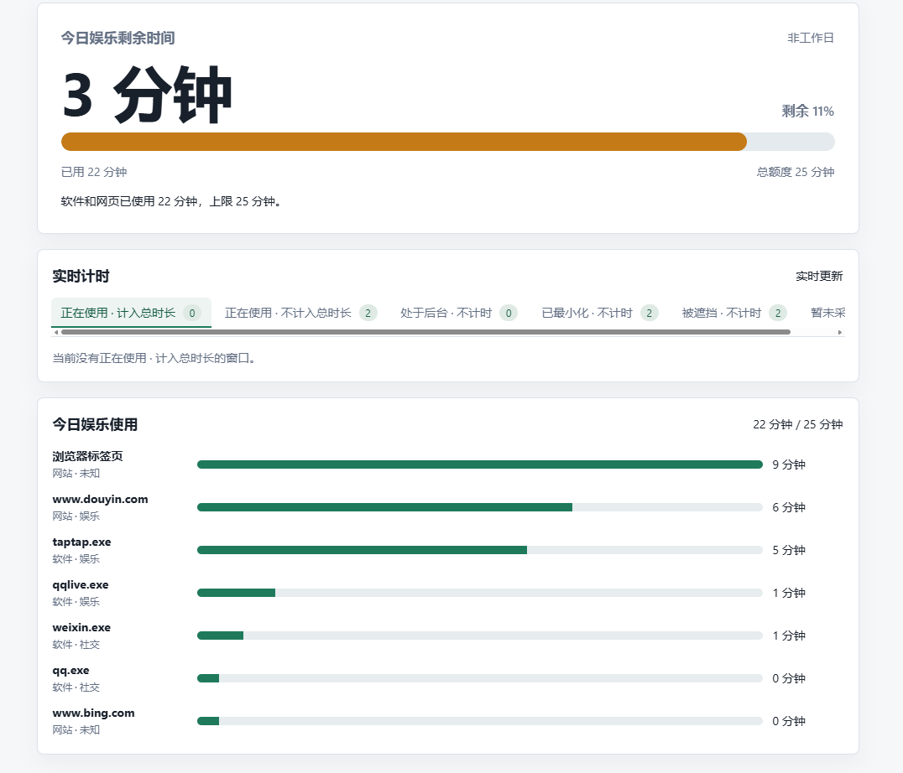

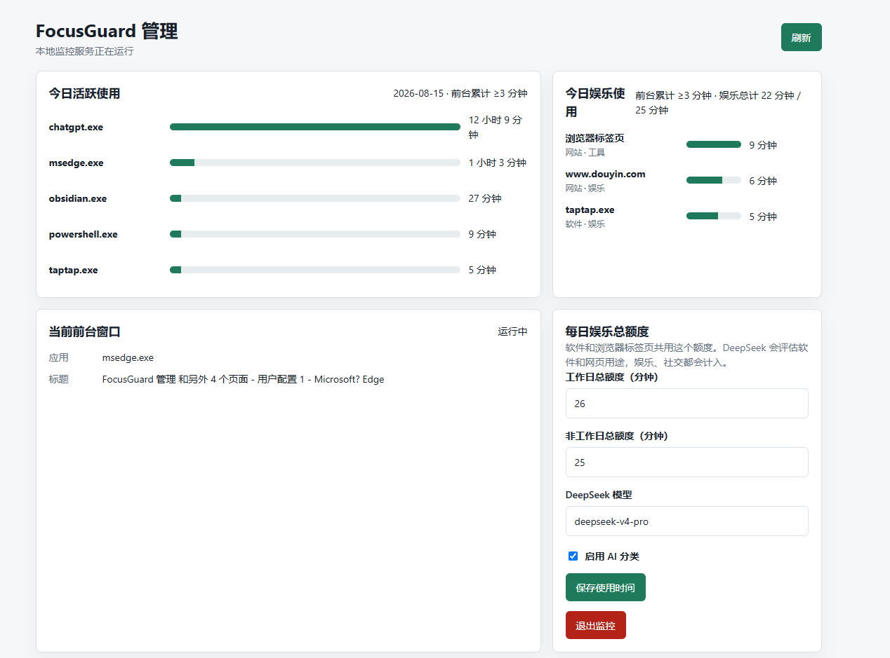

### 2. 浏览器网页用途识别

打开 4399 等游戏页面时，页面会被归入娱乐；打开洛谷题目列表或 OI Wiki 等编程学习资料时，会被归入学习，不消耗娱乐总额度。网页识别依赖浏览器扩展上报的 URL、标题和标签页状态；扩展不可用时，原生窗口监控仍可工作，但后台标签页只能使用标题兜底。

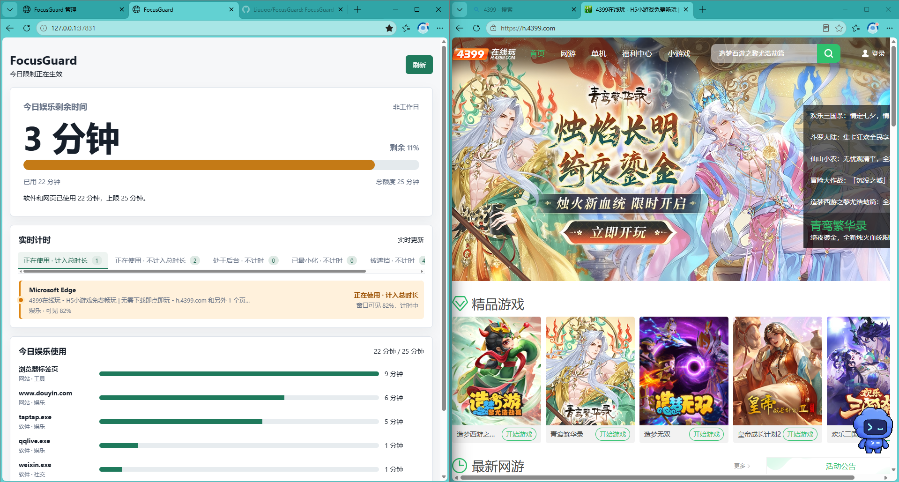

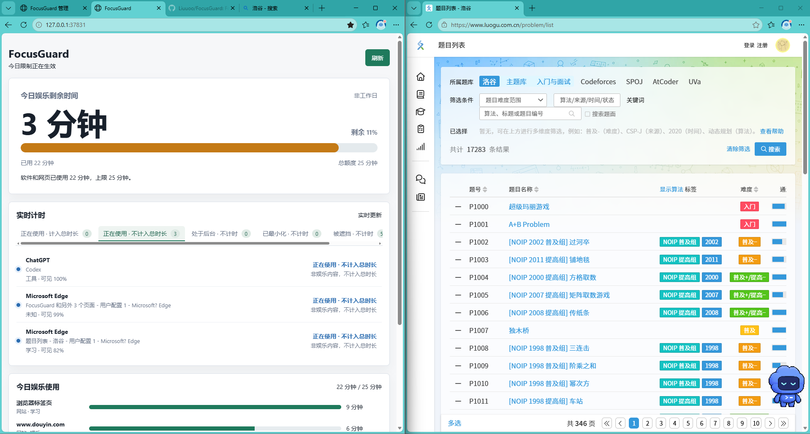

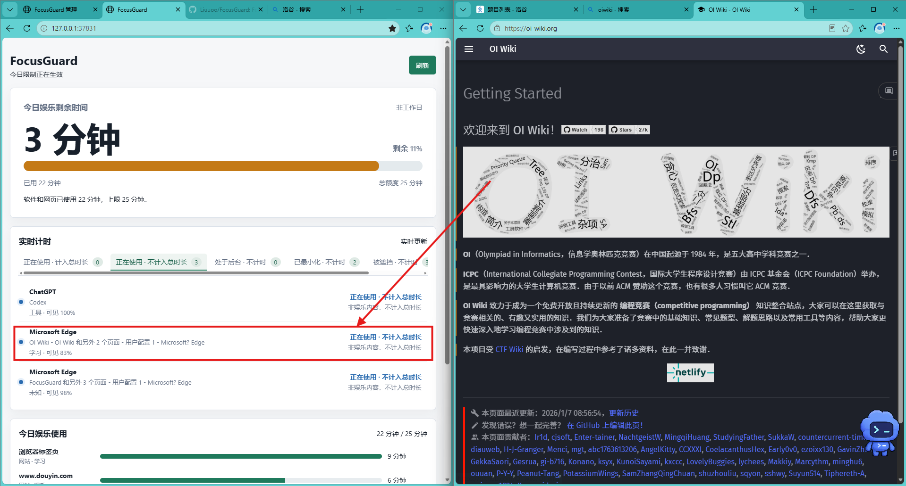

### 3. 软件用途识别

TapTap 等内容消费类软件会进入娱乐分类。服务先通过 Windows 进程采样获得进程名、窗口标题等信息，再将必要的用途信息交给 DeepSeek；结果会在本地缓存，重复出现的软件不会每秒重复请求 AI。

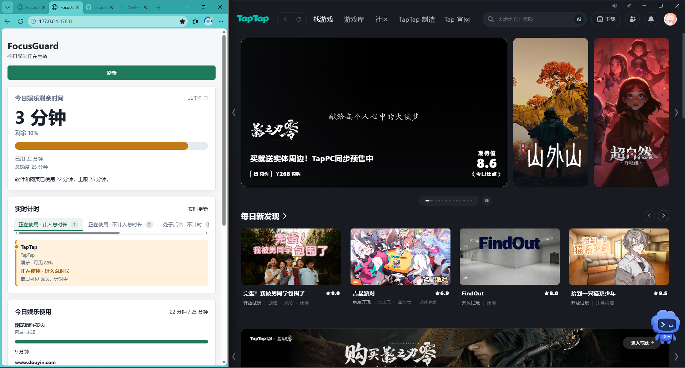

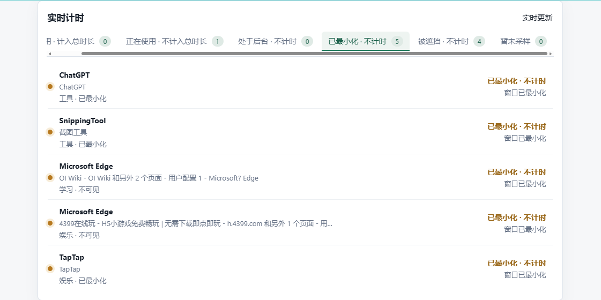

内容制作、办公、开发、学习和系统工具不因为“可以制作娱乐内容”就自动被判为娱乐。例如 OBS 应归为工具；无法确认的新软件会保留为未知，交由家长手动分组。

### 4. 前台、可见比例与后台

计时不只看“哪个窗口获得焦点”，而是采样窗口在屏幕上的实际可见区域。两个窗口并排显示时，两个窗口都可以计时；窗口完全被遮挡、最小化或处于后台时停止计时，避免把忘记关闭的后台页面算成使用时间。

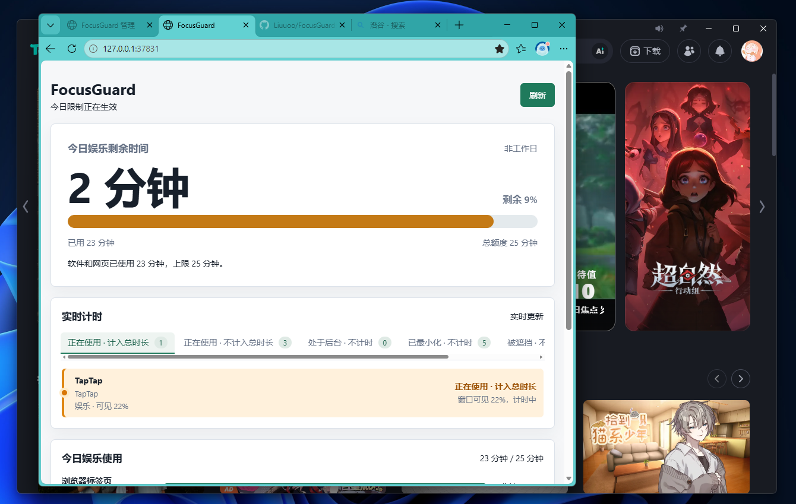

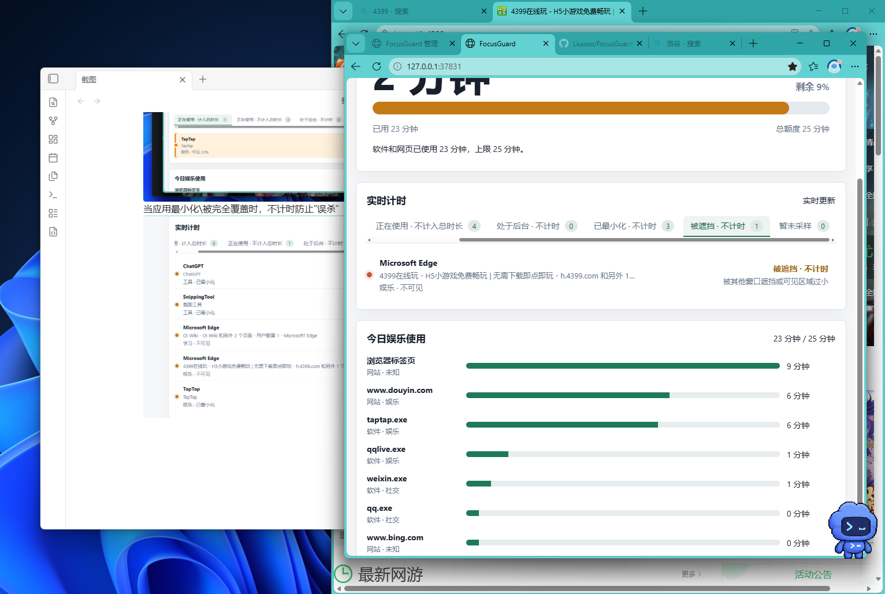

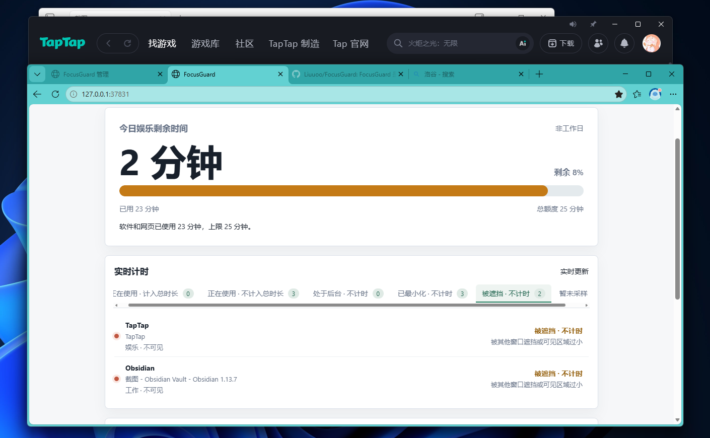

儿童端会把实时窗口分成以下状态：

| 状态 | 计入娱乐总额度 | 说明 |
| --- | --- | --- |
| 正在使用 · 计入总时长 | 是 | 窗口有可见区域，且用途是娱乐或社交 |
| 正在使用 · 不计入总时长 | 否 | 窗口有可见区域，但用途是工具、工作或学习 |
| 处于后台 | 否 | 进程仍在运行，但不作为当前可见窗口处理 |
| 已最小化 | 否 | 窗口已最小化 |
| 被遮挡 | 否 | 窗口可见面积为零或低于有效阈值 |
| 暂未采样 | 否 | Windows 暂时无法取得可靠的窗口状态 |

“正在使用 · 计入总时长”会使用橙色背景突出显示。管理端的“今日活跃使用”和“今日娱乐使用”只展示前台/可见累计达到 3 分钟的记录。

### 5. 隐藏运行与开机自启

程序可以作为隐藏的 Windows 计划任务启动，不创建托盘图标，也不在桌面放置快捷方式。项目路径可以放在指定的本地目录中；隐藏运行不会改变管理员密码和 Windows 权限边界。

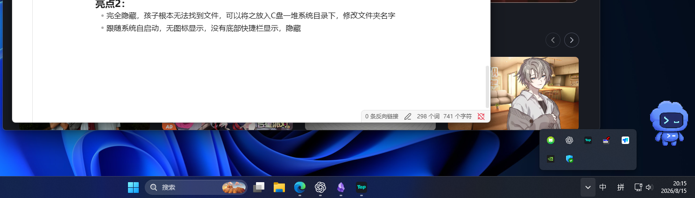

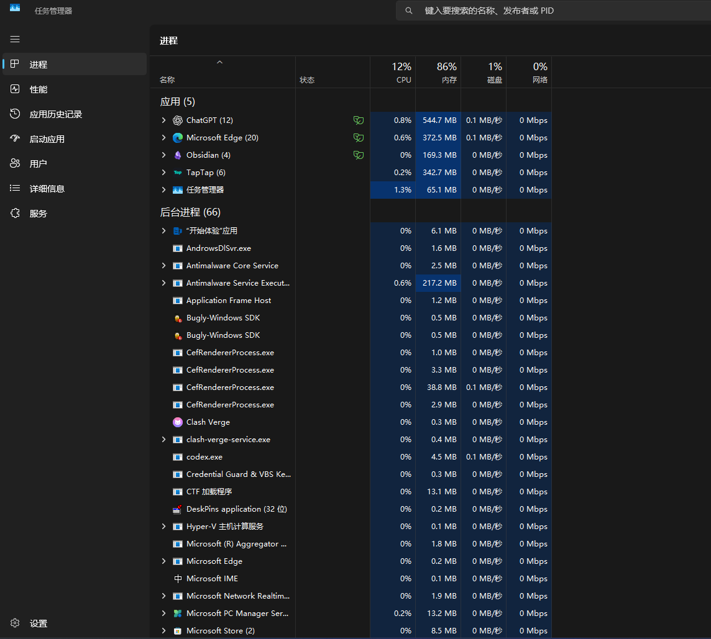

### 6. 达到额度后的限制

当软件和网页共享的娱乐总额度耗尽后，系统会针对娱乐软件执行关闭，对浏览器中的受限娱乐标签页请求关闭。正常的学习、工作和工具页面不会因为娱乐额度耗尽而被关闭。

视频演示了腾讯视频、哔哩哔哩等娱乐页面在额度到达上限后被自动关闭的过程。下面的 GIF 是基于原始素材生成的 2 倍速、30fps 版本，可以直接在 GitHub 页面播放，不需要先下载：

如需保留声音或查看高清原始录屏，可以下载 [原始 MP4 视频](docs/demo/media/limit-demo.mp4)。

### 7. 亮点 4：未知的网站或者软件

对于未知的网站或者软件，家长可以选择进行分类（也可以不选择，未知时无限制使用）。未知内容不会因为无法确认就直接被判定为娱乐；保持未知时，不计入娱乐额度，也不会触发自动关闭。

可以结合今日活跃使用的进程进行查收。某一天活跃进程异常时，可能存在尚未识别的娱乐软件，家长可以在管理端进一步确认。

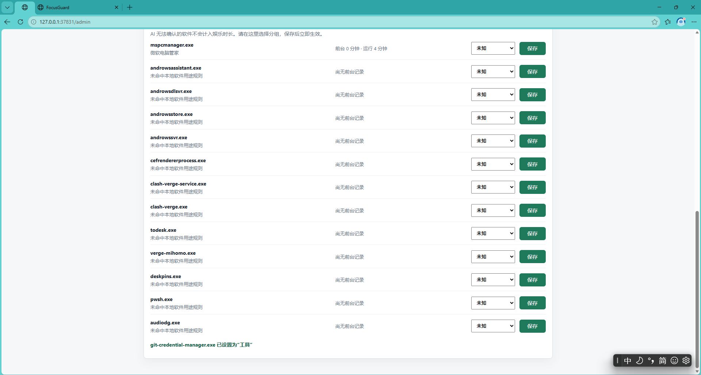

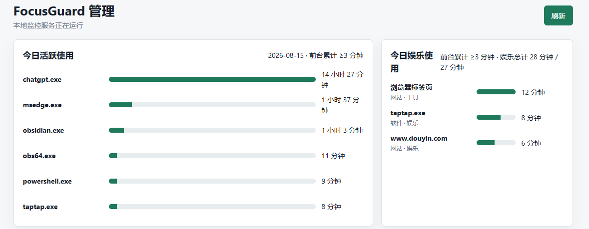

## 功能概览

- 儿童查看页：剩余时间、额度进度、实时窗口状态和娱乐明细
- 密码保护的管理端：额度、AI、未知软件分类和退出监控
- 软件、窗口和浏览器标签页统一计入一份娱乐总额度
- DeepSeek Pro 模型评估软件与网页用途
- 周六日自动作为休息日，寒假和暑假日期可配置为休息日
- 原生 Windows 窗口采样，不依赖窗口焦点才能识别
- 识别前台、并排可见、部分可见、被遮挡、最小化和后台状态
- Edge/Chrome 扩展上报活动标签页；扩展缺失时保留原生窗口兜底
- 可选安装 Edge/Chrome 企业策略，降低扩展被删除或禁用的绕过风险
- 常见其他浏览器进程阻止和浏览器安装包隔离
- 隐藏计划任务开机自启，不创建托盘图标

## 计时与分类规则

### 可见面积计时

FocusGuard 默认每秒采样一次 Windows 顶层窗口：

- 完全可见：按 100% 计时
- 两个窗口并排各占一半：各按约 50% 计时
- 只露出一部分：按有效可见比例计时
- 完全被覆盖：停止计时
- 最小化：停止计时
- 处于其他虚拟桌面或暂时无法采样：停止计时并显示暂未采样

因此，窗口没有获得系统焦点但仍然显示在屏幕上时，可以计入时间；放到后面完全看不见的窗口不会因为忘记关闭而继续获得额度。

### 娱乐总额度

软件、浏览器标签页和社交内容共用同一个每日总额度。例如：

- TapTap 使用 30 分钟
- 抖音网页使用 20 分钟
- 其他社交软件使用 10 分钟

当天统一娱乐使用量为 60 分钟，而不是每个软件分别拥有一份额度。

只有 entertainment 和 social 会消耗额度。工具、工作、学习、新闻、购物和未知分类默认不消耗娱乐额度。

### 工作日、周末与寒暑假

管理端现在使用“工作日额度”和“休息日额度”：

- 周六、周日自动使用休息日额度
- 寒假、暑假日期需要家长在管理端填写开始和结束日期
- 填写的日期范围包含首尾两天，即使是周一至周五也使用休息日额度
- 寒假支持跨年，例如 2026-12-25 到 2027-02-15
- 日期留空表示不启用对应假期范围
- 日期无效、只填一端或开始日期晚于结束日期时，保存会被拒绝

程序不硬编码某个城市或学校的放假时间，因为中国不同地区、学校和年份的寒暑假日期可能不同。

### AI 分类

分类流程为：

1. 本地规则先识别明显的系统、工具和娱乐进程。
2. 未确定的软件或网页交给 DeepSeek deepseek-v4-pro 评估。
3. 资料不足时，AI 可以要求联网搜索，再结合搜索摘要进行第二次判断。
4. 结果在本地缓存约 7 天，减少重复请求。
5. 请求失败、未配置 key 或 AI 关闭时使用本地规则兜底。

分类不是绝对准确的内容审核。标题不完整、搜索结果不足或新发布的软件可能进入未知，家长可以在管理端手动分组。

## 达到额度后的限制

达到当天娱乐总额度后：

- 娱乐软件通过 Windows taskkill 关闭进程及其子进程
- 浏览器扩展请求关闭受限的娱乐标签页
- 没有扩展时，原生 Edge 窗口监控可以继续识别窗口；标签页关闭能力会下降
- 学习、工作、工具和健康使用电脑页面不会被当作娱乐目标关闭
- 关闭动作有冷却时间，避免反复对同一进程执行操作
- 目标程序若以更高权限运行，FocusGuard 也需要以管理员权限运行，否则 Windows 可能拒绝关闭

这套机制的目标是提高限制成本，而不是声称可以抵抗拥有管理员权限的人。

## 部署

### 1. 系统要求

- Windows 10 或 Windows 11
- Node.js 18 或更高版本，并且 node.exe 位于 PATH
- Windows PowerShell 5.1 或更高版本
- 安装开机任务、浏览器企业策略或关闭管理员权限程序时，需要管理员 PowerShell
- Edge 强制扩展功能需要已安装 Microsoft Edge；Chrome 模式需要已安装 Google Chrome
- AI 分类需要 DeepSeek API key；没有 key 时仍可使用窗口监控和本地规则兜底

### 2. 获取项目

    git clone https://github.com/Liuuoo/FocusGuard.git
    cd FocusGuard
    node --version
    npm --version

项目不依赖第三方 npm 包，通常不需要执行 npm install。

### 3. 配置 DeepSeek API key

使用 AI 评估软件和网页时，需要准备 DeepSeek API key。不要把 key 写入代码、README、浏览器扩展、截图或 Git 仓库。

推荐写入运行 FocusGuard 的 Windows 用户环境变量：

    [Environment]::SetEnvironmentVariable(
        "DEEPSEEK_API_KEY",
        "在这里填写你的 DeepSeek key",
        "User"
    )

设置后必须重新打开 PowerShell，并重启 FocusGuard。只检查是否存在，不要输出 key：

    ([Environment]::GetEnvironmentVariable("DEEPSEEK_API_KEY", "User")) -ne $null

预期结果为 True。计划任务默认以安装任务的登录用户运行，因此 key 必须属于同一个 Windows 用户。服务端会通过 HTTPS 请求 DeepSeek，key 不会进入浏览器扩展。

启动后可以检查：

    $status = Invoke-RestMethod http://127.0.0.1:37831/api/status
    $status | Select-Object monitoring,deepSeekConfigured,dayLabel,dayReason | Format-List

如果 key 曾经被粘贴到公开聊天、截图、日志或仓库，应先在服务商控制台撤销并重新生成。

### 4. 启动服务

普通启动：

    npm start

隐藏启动：

    .\start-focusguard.ps1

需要关闭管理员权限软件时，使用管理员 PowerShell：

    .\start-focusguard-admin.ps1

打开页面：

    儿童端：http://127.0.0.1:37831/
    管理端：http://127.0.0.1:37831/admin

首次进入管理端时设置至少 6 位的管理密码。密码只以 PBKDF2 哈希形式保存在本机 data\focusguard.json 中。

### 5. 设置额度和寒暑假

登录管理端后设置：

1. 工作日每日娱乐额度
2. 休息日每日娱乐额度
3. 寒假开始和结束日期
4. 暑假开始和结束日期
5. 是否启用 DeepSeek AI 分类

默认额度为工作日 60 分钟、休息日 120 分钟。将某个额度设置为 0 表示当天不设置有效的自动关闭上限。

填写寒暑假后点击保存，管理端会提示“设置成功”；儿童端会显示“休息日（寒假）”或“休息日（暑假）”。

### 6. 配置开机自启

推荐使用管理员 PowerShell：

    .\install-startup-admin.ps1

它会创建名为 FocusGuard 的隐藏计划任务，在用户登录后通过 wscript.exe 和独立的 Node 进程启动本地服务，不创建托盘图标。启动过程中不会显示 PowerShell 或终端窗口；即使启动脚本很快退出，Node 服务也不会依赖那个窗口继续运行。启动脚本通过自身位置定位项目，不依赖当前电脑的用户名或固定盘符。

如果之前已经安装过旧版开机任务，更新脚本后需要重新执行一次 install-startup-admin.ps1，让任务改用静默启动器。

查看任务：

    Get-ScheduledTask -TaskName FocusGuard

### 7. 配置 Edge/Chrome 浏览器监控

#### 临时调试安装

1. 打开 Edge 或 Chrome 的扩展管理页。
2. 开启开发人员模式。
3. 选择“加载解压缩的扩展”。
4. 选择项目中的 browser-extension 目录。

扩展只向 http://127.0.0.1:37831 上报活动标签页、标题、URL、窗口边界和窗口状态，DeepSeek key 不会进入扩展。

#### 管理员强制安装

推荐在管理员 PowerShell 中执行：

    # 只管理 Edge
    .\install-browser-force.ps1

    # 同时管理 Edge 和 Chrome
    .\install-browser-force.ps1 -Browser Both

    # 只管理 Chrome
    .\install-browser-force.ps1 -Browser Chrome

脚本会使用本机浏览器打包扩展、保存本地签名私钥、写入企业强制安装策略并将扩展加入允许列表。安装成功后重启浏览器，在下面页面检查：

    Edge：edge://policy
    Chrome：chrome://policy

普通浏览器用户不能删除或禁用强制安装项，但 Windows 管理员仍可以修改企业策略，这是 Windows 的权限边界。

如需禁止 Edge 的所有下载：

    .\install-browser-force.ps1 -BlockAllEdgeDownloads

### 8. 验证部署

    Invoke-RestMethod http://127.0.0.1:37831/api/status | ConvertTo-Json
    Invoke-RestMethod http://127.0.0.1:37831/api/child-summary | ConvertTo-Json -Depth 8

重点确认：

- monitoring 为 True
- foregroundMonitoring 为 True
- processMonitoring 为 True
- browserDownloadGuardMonitoring 为 True
- 使用 AI 时 deepSeekConfigured 为 True
- dayLabel 和 dayReason 与当天的周末/寒暑假设置一致

## 可移植性与运行数据

项目可以放在任意目录，例如 C:\FocusGuard、D:\Tools\FocusGuard 或用户文档目录。脚本通过自身位置定位服务、数据和日志，不依赖当前电脑的用户名。

换电脑部署时，需要重新准备 Node.js、DeepSeek key、管理员权限、浏览器和本地配置。GitHub 仓库不会携带原电脑的管理密码、使用记录、分类缓存或扩展签名私钥。

运行时内容包括：

    data\focusguard.json                         配置、密码哈希、统计和分类缓存
    data\browser-extension\focusguard.pem       扩展签名私钥
    data\browser-extension\focusguard.crx       打包后的扩展
    data\quarantine\browser-installers\        被隔离的浏览器安装包
    logs\                                         服务和策略安装日志

这些目录已被 .gitignore 排除，不应上传到 GitHub。尤其不要上传 focusguard.pem 或任何 API key。

## 停止与卸载

管理端的“退出监控”需要管理密码。删除开机任务：

    .\uninstall-startup-task.ps1

该命令不会自动删除 data、logs 或浏览器企业策略。完全重置本地配置前，先停止服务；下面命令会删除统计记录、管理密码、分类缓存和扩展签名材料：

    Remove-Item -LiteralPath .\data, .\logs -Recurse -Force

删除浏览器策略前，应先检查 edge://policy 或 chrome://policy，避免影响同一台电脑上的其他策略。

## 常见问题

### AI 没有生效

确认 DEEPSEEK_API_KEY 写入的是运行服务的同一个 Windows 用户环境变量，重新打开 PowerShell 并重启计划任务。没有 key 时服务仍能运行，但会使用本地规则兜底。

### 寒暑假没有变成休息日

确认管理端的开始和结束日期都已填写，并点击保存。日期范围包含首尾两天；如果只填写一端、日期不存在或开始日期晚于结束日期，服务会拒绝保存。

### 娱乐软件没有被关闭

检查每日总额度是否达到、AI 是否把目标判为 entertainment 或 social、FocusGuard 是否以管理员权限运行，以及管理端是否显示 lastLimitError。

### 浏览器标签页没有被识别

确认扩展已安装、浏览器已重启并能访问 http://127.0.0.1:37831。没有扩展时，原生窗口可以计时，但无法可靠获得同一窗口中所有后台标签页的 URL。

### 强制安装脚本失败

常见原因是没有使用管理员 PowerShell、浏览器正在运行、浏览器不在默认位置、组策略阻止注册表写入或 Node.js 不在 PATH。关闭浏览器后重试，并查看 logs\browser-policy-installer.log。

### 端口被占用

默认端口是 37831：

    Get-NetTCPConnection -LocalPort 37831 -State Listen

启动脚本、浏览器扩展和部署文档默认都使用该端口；改端口时必须同时调整服务、扩展权限和策略安装脚本。

## 开发与测试

语法检查：

    node --check src\server.js
    node --check src\schedule.js
    node --check public\app.js
    node --check public\child.js

运行测试：

    npm test

测试覆盖 AI 软件分类、OBS 工具识别、未知软件研究流程、周末判断、寒暑假工作日判断、跨年寒假和日期校验。

## 项目结构

    src/server.js                    本地 HTTP 服务、计时、AI、限制和 API
    src/schedule.js                  工作日、周末和寒暑假休息日判断
    src/app-classifier.js            软件分类、提示词、搜索和 AI 结果解析
    src/foreground.ps1               原生窗口、前台窗口和可见矩形采样
    src/processes.ps1                进程列表采样
    src/browser-download-guard.ps1   浏览器进程和安装包防绕过
    src/close-browser-tab.ps1        浏览器标签页原生关闭兜底
    browser-extension/               Edge/Chrome 扩展源代码
    public/index.html                儿童端页面
    public/admin.html                管理端页面
    install-startup-admin.ps1        管理员安装开机任务
    start-focusguard-silent.vbs      无窗口触发开机启动
    install-browser-force.ps1        管理员安装浏览器强制策略
    docs/demo/screenshots/           真实使用截图
    docs/demo/media/limit-demo.gif   原始限制演示 GIF
    docs/demo/media/limit-demo-2x-30fps.gif  2 倍速、30fps 限制演示 GIF
    docs/demo/media/limit-demo.mp4   带声音的高清原始录屏
    data/                            运行时生成，不提交
    logs/                            运行时生成，不提交
